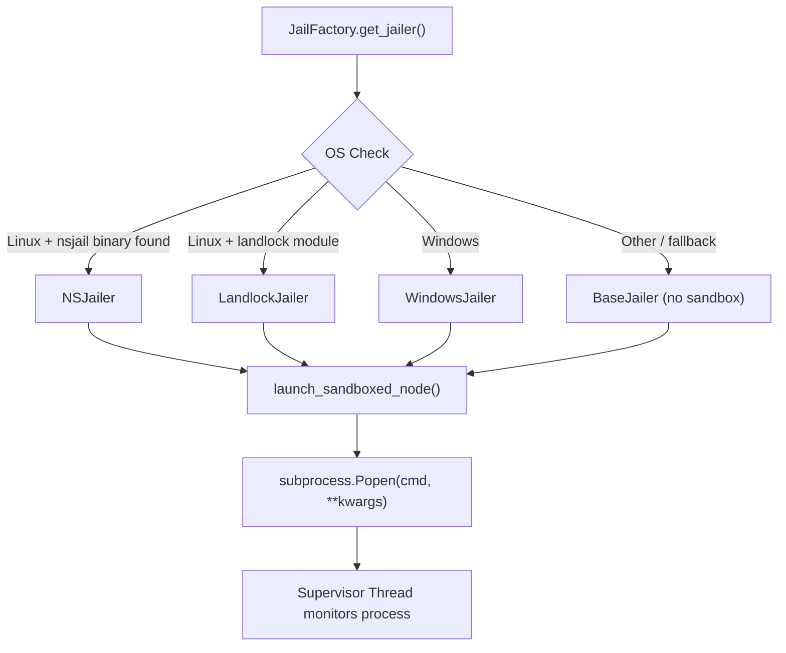

# 🏛️ NSJail Deep Dive — What It Is, Where It Is, How to Improve It

> [!NOTE]
> This doc explains NSJail in plain English, shows exactly where your friend implemented it, how it works in the real world, and gives **12+ concrete improvement ideas** you can present.

---

## 1. What is NSJail? (Real-World Explanation)

**NSJail** (Namespace Jail) is a **lightweight Linux sandboxing tool** created by Google. It uses **Linux kernel namespaces** to isolate processes — meaning you can run a program inside a "virtual bubble" where it:

- 🚫 **Can't see** other processes on the system
- 🚫 **Can't access** files outside the allowed directories
- 🚫 **Can't use** the network (if configured)
- 🚫 **Can't escape** even if the process is compromised

### Real-World Analogy

Think of it like putting a prisoner in a jail cell:
- The prisoner (MCP tool server) thinks it's in its own world
- It can only see the walls of its cell (allowed directories)
- It can't reach into other cells (other processes)
- Even if it breaks free from its chains (exploited by LLM), it's still inside the cell

### Linux Kernel Features NSJail Uses

| Feature | What It Does |
|---------|-------------|
| **PID Namespace** | Process only sees itself — can't see/kill other processes |
| **Mount Namespace** | Process has its own filesystem view — can't access host files |
| **Network Namespace** | Process has its own network stack — can't reach the internet |
| **User Namespace** | Process runs as "root" inside jail but has zero privileges outside |
| **IPC Namespace** | Process can't communicate with other processes via shared memory |
| **cgroup limits** | CPU, memory, and disk I/O limits — can't DoS the host |

### Why Does This Matter for AI Security?

In your Runtime Shield, when the AI (Claude) uses a tool like `read_file`, that tool runs inside a **Node.js process**. If a clever prompt injection tricks the tool into executing malicious code, **NSJail prevents that code from escaping** to the rest of the system.

---

## 2. Where Is It in Your Code?

Everything lives in [bridge.py](file:///c:/Users/jasha/OneDrive/Desktop/Runtime-shield-for-agentic-systems/Runtime-shield-for-agentic-systems/bridge.py), starting at **line 289**.

### The Architecture: Pluggable Jail Factory



### The 4 Jailer Classes

#### 1. `BaseJailer` (Lines 293-310) — No Sandbox (Fallback)
```python
class BaseJailer:
    def get_popen_kwargs(self, cmd):
        return {
            "cwd": self.cwd,
            "stdin": subprocess.PIPE,
            "stdout": subprocess.PIPE,
            "stderr": subprocess.PIPE,
            "text": True,
            "env": self.env
        }
```
> Just runs the process normally. No isolation at all. This is the **fallback** when no sandbox is available.

#### 2. `LandlockJailer` (Lines 312-330) — Linux Kernel File Restriction
```python
class LandlockJailer(BaseJailer):
    def get_popen_kwargs(self, cmd):
        kwargs = super().get_popen_kwargs(cmd)
        def landlock_preexec():
            rs = landlock.Ruleset()
            rs.allow(PROJECT_DIR)
            for p in self.allowed_paths:
                rs.allow(p)
            rs.apply()
        kwargs["preexec_fn"] = landlock_preexec
```
> Uses **Landlock** (Linux 5.13+) to restrict which files the process can access. Lighter than NSJail but only controls filesystem access, not process/network isolation.

#### 3. `NSJailer` (Lines 332-357) — Full Namespace Isolation ⭐
```python
class NSJailer(BaseJailer):
    def get_popen_kwargs(self, cmd):
        nsjail_bin = shutil.which("nsjail")
        if not nsjail_bin:
            return super().get_popen_kwargs(cmd)  # fallback
        
        new_cmd = [
            nsjail_bin, "-Mo", 
            "--chroot", "/", 
            "-R", "/usr", "-R", "/lib", "-R", "/lib64", "-R", "/bin",
            "-B", self.cwd,
            "--"
        ] + cmd
        
        cmd[:] = new_cmd  # wraps the original command with nsjail
```
> This is the star of the show. It **wraps the MCP server command** with `nsjail`, giving it full namespace isolation. The flags mean:
> - `-Mo` → Run in "once" mode (single execution)
> - `--chroot /` → Set the jail root to `/`
> - `-R /usr, /lib, /lib64, /bin` → Read-only mount system directories (so Node.js can run)
> - `-B self.cwd` → Bind-mount the working directory (read-write, so the tool can operate)

#### 4. `WindowsJailer` (Lines 359-368) — Windows Process Groups
```python
class WindowsJailer(BaseJailer):
    def get_popen_kwargs(self, cmd):
        # Currently just logs — real implementation would use win32job
        log(f"🪟 Sandboxing [{self.provider_name}]: Windows Restricted Process Group initialized")
```
> On Windows (your current OS), this is a **placeholder**. It logs that sandboxing is active but doesn't actually restrict anything. In production, it would use Windows Job Objects.

### The Factory (Lines 370-384)

```python
class JailFactory:
    @staticmethod
    def get_jailer(provider_name, cwd, env, allowed_paths):
        if is_linux:
            if shutil.which("nsjail"):    # Priority 1: NSJail
                return NSJailer(...)
            if landlock:                   # Priority 2: Landlock
                return LandlockJailer(...)
        if sys.platform == 'win32':        # Priority 3: Windows
            return WindowsJailer(...)
        return BaseJailer(...)             # Fallback: no sandbox
```

### Where It Gets Used (Lines 386-403)

```python
def launch_sandboxed_node(cmd, cwd, env, allowed_paths=None, provider_name="unknown"):
    jailer = JailFactory.get_jailer(provider_name, cwd, env, allowed_paths)
    popen_kwargs = jailer.get_popen_kwargs(cmd)
    proc = subprocess.Popen(cmd, **popen_kwargs)
    
    # Supervisor thread monitors for unexpected exits
    def supervise():
        proc.wait()
        log(f"🚨 SUPERVISOR ALERT: Jailed process '{provider_name}' exited unexpectedly")
    threading.Thread(target=supervise, daemon=True).start()
    return proc
```

---

## 3. Current Limitations (What's Missing)

| # | Issue | Impact |
|---|-------|--------|
| 1 | **Windows has no real sandbox** | On your dev machine (Windows), `WindowsJailer` is a no-op — tools run unrestricted |
| 2 | **No network namespace** | NSJailer doesn't add `-N` flag, so jailed processes can still make network calls |
| 3 | **No resource limits** | No CPU/memory/time limits — a compromised tool could DoS the system |
| 4 | **No seccomp filters** | System calls aren't filtered — process can use any Linux syscall |
| 5 | **cmd[:] = new_cmd is hacky** | Mutates the command list in-place instead of returning a new one |
| 6 | **No cgroup integration** | Can't limit disk I/O or number of file descriptors |
| 7 | **`-Mo` is single-exec** | Doesn't support persistent jailed processes well |
| 8 | **No jail config file** | All NSJail options are hardcoded — should use `.cfg` protobuf files |
| 9 | **No health monitoring** | Supervisor only detects exit, doesn't monitor resource usage |
| 10 | **Fallback is silent** | If NSJail isn't installed, it silently falls back to no sandbox with just a log message |
| 11 | **No per-tool isolation** | All tools from the same provider share the same jail |
| 12 | **No tmpfs for sensitive data** | Temporary files in the jail persist on disk |

---

## 4. Improvement Ideas (12+ Concrete Proposals)

### 🔴 Critical Improvements

#### 1. Add Network Isolation
```python
# Current
new_cmd = [nsjail_bin, "-Mo", "--chroot", "/", ...]

# Improved — add network namespace isolation
new_cmd = [
    nsjail_bin, "-Mo",
    "--chroot", "/",
    "-N",                    # ← NEW: Disable networking entirely
    "--iface_no_lo",         # ← NEW: No loopback interface
    ...
]
```
> **Why:** Without `-N`, a compromised tool server can exfiltrate data by making HTTP requests to an attacker's server.

#### 2. Add Resource Limits (cgroup)
```python
new_cmd = [
    nsjail_bin, "-Mo",
    "--chroot", "/",
    "--rlimit_as", "512",         # Max 512MB virtual memory
    "--rlimit_cpu", "30",         # Max 30 seconds CPU time
    "--rlimit_fsize", "10",       # Max 10MB file creation
    "--rlimit_nofile", "64",      # Max 64 open file descriptors
    "--rlimit_nproc", "10",       # Max 10 child processes
    "--time_limit", "60",         # Kill after 60 seconds wall time
    ...
]
```
> **Why:** Prevents Denial-of-Service attacks from within the jail.

#### 3. Add Seccomp Syscall Filtering
```python
new_cmd = [
    nsjail_bin, "-Mo",
    "--seccomp_string",
    "ALLOW { read, write, open, close, stat, fstat, mmap, mprotect, "
    "munmap, brk, ioctl, access, pipe, select, sched_yield, "
    "clone, execve, exit, exit_group, futex, set_robust_list }",
    "--seccomp_log",              # Log blocked syscalls
    ...
]
```
> **Why:** Even inside the jail, restricting syscalls prevents kernel exploits.

### 🟡 Important Improvements

#### 4. Use Protobuf Config Files Instead of CLI Flags
```protobuf
# nsjail_tool.cfg
name: "mcp-tool-jail"
mode: ONCE

mount {
    src: "/usr"    dst: "/usr"    is_bind: true    rw: false
}
mount {
    src: "/lib"    dst: "/lib"    is_bind: true    rw: false
}
mount {
    src_content: ""    dst: "/tmp"    fstype: "tmpfs"    rw: true
}

rlimit_as_type: SOFT
rlimit_cpu_type: SOFT
rlimit_fsize_type: SOFT

seccomp_string: "ALLOW { ... }"
```
Then in Python:
```python
new_cmd = [nsjail_bin, "--config", "/path/to/nsjail_tool.cfg", "--", *cmd]
```
> **Why:** Config files are easier to maintain, version-control, and audit than long CLI strings.

#### 5. Implement Real Windows Sandboxing
```python
class WindowsJailer(BaseJailer):
    def get_popen_kwargs(self, cmd):
        kwargs = super().get_popen_kwargs(cmd)
        if sys.platform == 'win32':
            import win32job
            import win32process
            
            # Create a Job Object with restrictions
            job = win32job.CreateJobObject(None, f"mcp-jail-{self.provider_name}")
            
            # Set limits
            info = win32job.QueryInformationJobObject(job, win32job.JobObjectExtendedLimitInformation)
            info['BasicLimitInformation']['LimitFlags'] = (
                win32job.JOB_OBJECT_LIMIT_KILL_ON_JOB_CLOSE |    # Kill all when bridge exits
                win32job.JOB_OBJECT_LIMIT_PROCESS_MEMORY |        # Memory limit per process
                win32job.JOB_OBJECT_LIMIT_JOB_TIME               # Total CPU time limit
            )
            info['ProcessMemoryLimit'] = 512 * 1024 * 1024  # 512 MB
            info['BasicLimitInformation']['PerJobUserTimeLimit'] = 60 * 10_000_000  # 60 seconds
            win32job.SetInformationJobObject(job, win32job.JobObjectExtendedLimitInformation, info)
            
            self._job = job
            kwargs["creationflags"] = subprocess.CREATE_BREAKAWAY_FROM_JOB | subprocess.CREATE_NEW_PROCESS_GROUP
        return kwargs
```
> **Why:** Your team runs on Windows. Without this, there's **zero sandboxing** in your dev/demo environment.

#### 6. Per-Tool Jail Isolation
```python
# Instead of one jail per MCP server, create separate jails per tool
def launch_tool_in_jail(tool_name, tool_args, provider):
    """Each tool invocation gets its own ephemeral jail."""
    jail_dir = tempfile.mkdtemp(prefix=f"shield-jail-{tool_name}-")
    jailer = JailFactory.get_jailer(
        provider_name=f"{provider}/{tool_name}",
        cwd=jail_dir,
        env=minimal_env_for(tool_name),  # Only needed env vars
        allowed_paths=paths_for(tool_name)  # Only needed paths
    )
    # ... run and cleanup
```
> **Why:** Currently all tools from the same provider share a jail. If `write_file` is compromised, it can affect `read_file` data.

#### 7. tmpfs for Sensitive Operations
```python
# Mount a tmpfs (RAM-only filesystem) for temporary data
new_cmd = [
    nsjail_bin, "-Mo",
    "--chroot", "/",
    "-T", "/tmp",              # ← Mount tmpfs at /tmp inside jail
    "--mount", "none:/dev/shm:tmpfs:rw",  # Shared memory as tmpfs
    ...
]
```
> **Why:** Sensitive data processed by tools never hits disk — it stays in RAM and is wiped when the jail exits.

### 🟢 Nice-to-Have Improvements

#### 8. Jail Health Monitor Dashboard Integration
```python
class JailHealthMonitor:
    """Monitor jail resource usage and report to dashboard."""
    
    def __init__(self, proc, provider_name, dashboard_state):
        self.proc = proc
        self.provider_name = provider_name
        self.dashboard = dashboard_state
        
    def monitor(self):
        while self.proc.poll() is None:
            try:
                import psutil
                p = psutil.Process(self.proc.pid)
                memory_mb = p.memory_info().rss / (1024 * 1024)
                cpu_percent = p.cpu_percent(interval=1)
                
                if memory_mb > 400:  # Warning at 400MB
                    self.dashboard.add_event({
                        "action": "warn",
                        "tool": f"jail-{self.provider_name}",
                        "reason": f"Jail memory usage high: {memory_mb:.0f}MB",
                        "severity": "medium"
                    })
            except Exception:
                pass
            time.sleep(5)
```

#### 9. Fail-Closed on Missing Sandbox
```python
class JailFactory:
    @staticmethod
    def get_jailer(provider_name, cwd, env, allowed_paths):
        fail_open = os.getenv("JAIL_FAIL_OPEN", "false").lower() == "true"
        
        if is_linux:
            if shutil.which("nsjail"):
                return NSJailer(...)
            if landlock:
                return LandlockJailer(...)
            
            if not fail_open:
                raise RuntimeError(
                    f"❌ SECURITY: No sandbox available for {provider_name}. "
                    "Install nsjail or enable Landlock. "
                    "Set JAIL_FAIL_OPEN=true to override (NOT RECOMMENDED)."
                )
        
        if sys.platform == 'win32':
            return WindowsJailer(...)
        
        if not fail_open:
            raise RuntimeError("❌ No sandbox available and JAIL_FAIL_OPEN is not set.")
        
        log("⚠️ WARNING: Running without sandboxing! JAIL_FAIL_OPEN=true")
        return BaseJailer(...)
```
> **Why:** Currently, if NSJail isn't installed, the system silently runs without any sandbox — a massive security gap.

#### 10. Audit Log for Jail Events
```python
def launch_sandboxed_node(cmd, cwd, env, allowed_paths=None, provider_name="unknown"):
    jailer = JailFactory.get_jailer(provider_name, cwd, env, allowed_paths)
    
    # Log jail configuration for audit trail
    log(f"🏛️ JAIL AUDIT: provider={provider_name}, "
        f"jailer={jailer.__class__.__name__}, "
        f"allowed_paths={allowed_paths}, "
        f"cwd={cwd}")
    
    dashboard_state.add_event({
        "action": "info",
        "tool": f"jail-{provider_name}",
        "agent": "jail-factory",
        "reason": f"Sandbox started: {jailer.__class__.__name__}",
        "severity": "low",
        "stage": "sandbox-init",
        "timestamp": time.time()
    })
```

#### 11. Jail Escape Detection
```python
def supervise(proc, provider_name, jail_cwd):
    """Enhanced supervisor that detects potential jail escape attempts."""
    while proc.poll() is None:
        try:
            p = psutil.Process(proc.pid)
            children = p.children(recursive=True)
            
            for child in children:
                # Check if child process is accessing files outside jail
                open_files = child.open_files()
                for f in open_files:
                    if not f.path.startswith(jail_cwd) and not f.path.startswith("/usr"):
                        log(f"🚨 JAIL ESCAPE ATTEMPT: Process {child.pid} accessing {f.path}")
                        child.kill()
                        
                # Check for suspicious network connections
                connections = child.connections()
                if connections:
                    log(f"🚨 JAIL NETWORK VIOLATION: Process {child.pid} has {len(connections)} connections")
        except (psutil.NoSuchProcess, psutil.AccessDenied):
            pass
        time.sleep(2)
```

#### 12. Docker-Based Fallback Jail (Cross-Platform)
```python
class DockerJailer(BaseJailer):
    """Uses Docker containers as a cross-platform jail alternative."""
    
    def get_popen_kwargs(self, cmd):
        docker_cmd = [
            "docker", "run", "--rm", "-i",
            "--network", "none",              # No network
            "--memory", "512m",               # Memory limit
            "--cpus", "0.5",                  # CPU limit
            "--read-only",                    # Read-only root
            "--tmpfs", "/tmp:size=100m",      # Writable /tmp in RAM
            "-v", f"{self.cwd}:/workspace:rw",  # Mount workspace
            "-w", "/workspace",
            "node:20-slim",                   # Minimal Node.js image
            *cmd
        ]
        return {**super().get_popen_kwargs(docker_cmd)}
```
> **Why:** Docker works on Windows, Mac, AND Linux — gives you a universal sandbox that works everywhere including your demo machine.

---

## 5. Priority Roadmap

| Priority | Improvement | Effort | Impact |
|----------|-------------|--------|--------|
| 🔴 P0 | Add network isolation (`-N` flag) | 1 line | **Critical** — prevents data exfil |
| 🔴 P0 | Add resource limits (rlimit flags) | 5 lines | **Critical** — prevents DoS |
| 🔴 P0 | Fail-closed when no sandbox | 10 lines | **Critical** — security guarantee |
| 🟡 P1 | Real Windows sandboxing (Job Objects) | 50 lines | **High** — works on your demo OS |
| 🟡 P1 | Seccomp syscall filtering | 10 lines | **High** — defense in depth |
| 🟡 P1 | NSJail protobuf config files | 30 lines | **Medium** — maintainability |
| 🟢 P2 | Per-tool isolation | 40 lines | **Medium** — blast radius reduction |
| 🟢 P2 | Docker fallback jail | 30 lines | **Medium** — cross-platform |
| 🟢 P2 | Jail health monitoring + dashboard | 50 lines | **Low** — observability |
| 🟢 P2 | Jail escape detection | 40 lines | **Medium** — active defense |
| 🟢 P3 | tmpfs for sensitive ops | 2 lines | **Low** — data protection |
| 🟢 P3 | Audit logging for jail events | 15 lines | **Low** — compliance |

---

## 6. Quick Summary for Your Presentation

> **"NSJail is Google's lightweight Linux sandboxing tool. In our Runtime Shield, it's Layer 1 of our 5-layer defense. When the AI agent calls a tool, that tool runs inside an isolated namespace jail — it can't see other processes, can't access unauthorized files, and can't reach the network. Even if a prompt injection compromises the tool server, the damage is contained inside the jail. Our implementation uses a Pluggable Jail Factory pattern that auto-selects the best sandbox for the OS: NSJail on Linux, Landlock as fallback, and Windows Job Objects on Windows."**

### One-Liner for Sir:
> *"NSJail gives us OS-level blast radius containment — think of it as Docker but lighter and specifically designed for security isolation."*
