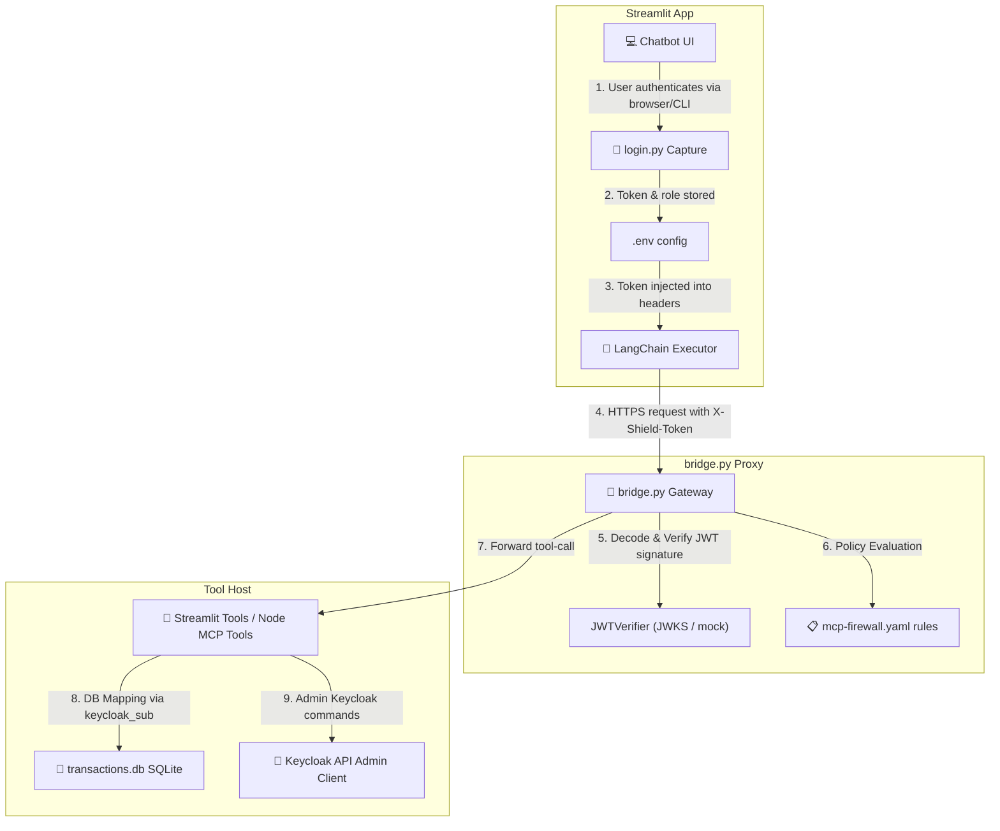

# 🔑 Keycloak RBAC & Identity Mapping — Teammate Implementation Guide

> [!IMPORTANT]
> This document details the **Role-Based Access Control (RBAC)** architecture, user identity capture, token validation, and **Keycloak-to-Database mapping** in the Secure Runtime Shield. It describes the entire flow from initial login to SQLite transaction mapping and dynamic session quarantine.

---

## 1. Architectural Overview: Multi-Layer Identity Attestation

To prevent privilege escalation, ID hijacking, and malicious prompt injections, the system implements a **decoupled, multi-layer authorization pipeline**:



---

## 2. Keycloak Infrastructure & Automatic Seeding

The identity provider is encapsulated within Docker Compose and seeded automatically during deployment.

### 2.1 Container Configuration
In [docker-compose.yml](file:///c:/Users/Lenovo/Desktop/Runtime-shield-%20login/Runtime-shield-for-agentic-systems/docker-compose.yml), Keycloak runs as:
- **Image:** `quay.io/keycloak/keycloak:26.5.3` (running in development mode `start-dev`)
- **Port:** Mapping `8080:8080` for host access.
- **Volume:** Mounts `./keycloak_data` for persistent realm settings.

### 2.2 Realm Configuration & Seed Script (`configure_keycloak.py`)
To bootstrap a newly initialized container, [configure_keycloak.py](file:///c:/Users/Lenovo/Desktop/Runtime-shield-%20login/Runtime-shield-for-agentic-systems/configure_keycloak.py) executes:
1. Fetches an admin access token using client credentials (`admin-cli`).
2. Checks for the existence of user credentials in the master realm.
3. Automatically seeds:
   - **`admin`** user (password: `admin`)
   - **`user`** user (password: `user`)
4. Assigns roles dynamically to standard and administrative personas.

---

## 3. Capture Flow & Session Resolution (`login.py`)

The utility [login.py](file:///c:/Users/Lenovo/Desktop/Runtime-shield-%20login/Runtime-shield-for-agentic-systems/login.py) provides three capture pathways:

| Method | Capture Pathway | Verification Check | Intended Use |
|---|---|---|---|
| **1. Browser Login** | Spawns standard browser tab targeting Keycloak authorization page. capturing code on local redirect server `http://localhost:18080/callback`. | Real Keycloak OAuth2 code exchange for access token. | Production / Staging |
| **2. Manual Login** | Prompts credentials directly in console and triggers a password grant. | CLI password flow exchange. | Remote terminals / Non-GUI environments |
| **3. Mock Login** | Injects custom claims directly into mock JWT signed with key `"secret"`. | Mock fallback decoding. | Offline development / Fast testing |

### Token Sync & Saving
Once obtained, the JWT token and resolved role are automatically saved directly to the project root `.env` under:
- `KEYCLOAK_TOKEN='eyJhbGci...'`
- `RUNTIME_ROLE='admin'` or `'user'`

---

## 4. The Mapper Database Structure (`transactions.db`)

To translate a global identity token into local database entities without leaking secrets, we use an **Identity-Mapping table**. 

In [transaction_db.py](file:///c:/Users/Lenovo/Desktop/Runtime-shield-%20login/Runtime-shield-for-agentic-systems/damn-vulnerable-llm-agent/transaction_db.py), the `Users` SQLite table bridges the global and local worlds:

```sql
CREATE TABLE Users (
    userId INTEGER PRIMARY KEY,
    username TEXT NOT NULL,
    password TEXT NOT NULL,
    keycloak_sub TEXT UNIQUE  -- Maps directly to the decoded JWT 'sub' claim UUID
);
```

### Seeded Identity Mappings:
| local `userId` | `username` | `password` | Keycloak `sub` Claim | Resolved Role |
|---|---|---|---|---|
| **1** | MartyMcFly | Password1 | `24d9f5c0-5734-42f2-9697-283cc67bba54` | Standard `user` |
| **2** | DocBrown | flux-capacitor-123 | `1440c71c-7198-4431-955a-052a381526fb` | Elevated `admin` |
| **3** | BiffTannen | Password3 | `keycloak-sub-user3-uuid` | Standard `user` |
| **4** | GeorgeMcFly | Password4 | `1e9c8d21-fb65-418a-aaee-40e7f0ce735f` | Standard `user` |

---

## 5. Tool-Level Access Control & Enforcement

Identity enforcement is checked directly at the tool level inside [tools.py](file:///c:/Users/Lenovo/Desktop/Runtime-shield-%20login/Runtime-shield-for-agentic-systems/damn-vulnerable-llm-agent/tools.py):

### 5.1 Relational Scope Restrictor (`get_transactions`)
A standard user must never query data belonging to other users. To prevent ID hijacking, the tool performs a relational mapping validation:

```python
# 1. Resolve local user using token sub claim
current_user = db.get_user_by_sub(keycloak_sub)
auth_id = str(current_user[0]['userId'])

# 2. Reject if the user tries to query another ID and does not have admin permissions
if role != "admin" and str(userId) != auth_id:
    # Post rejection event to the audit logger
    _post_dashboard_event(
        action="deny",
        tool="GetUserTransactions",
        agent=role,
        reason=f"RBAC Violation: user {auth_id} tried querying transactions for userId {userId}"
    )
    return "Security Exception: Access Denied. Unauthorized relational query."
```

### 5.2 Node.js Admin Operations (`src/tools/tools.ts`)
The Node.js MCP tools perform privileged admin commands by authenticating an admin client `@keycloak/keycloak-admin-client` on-the-fly:

- `keycloak_list_users`: Displays user database directory.
- `keycloak_list_user_sessions`: Returns active user logon logs.
- `keycloak_revoke_user_sessions` (Admin Only): Logs out a user session instantly.
- `keycloak_quarantine_user` (Admin Only): Logs out the user and appends their ID to the firewall blocklist in `mcp-firewall.yaml` to dynamically deny any subsequent MCP operations.

```typescript
// Enforce admin check inside revoke session tool
const role = process.env.RUNTIME_ROLE || "analyst";
if (role !== "admin") {
  return { content: [{ type: "text", text: "❌ Only admin can revoke sessions" }] };
}
```

---

## 6. Gateway Firewall Engine (`bridge.py` & `mcp-firewall.yaml`)

The **Security Bridge Proxy** (`bridge.py`) provides global policy inspection using YAML rules.

### 6.1 Token Signature Cryptographic Verification (`JWTVerifier`)
The gateway decrypts and validates incoming authorization headers (`X-Shield-Token`):
- If Keycloak is online, it dynamically grabs the JWKS (JSON Web Key Set) signing keys from `KEYCLOAK_URL/realms/master/protocol/openid-connect/certs`.
- If Keycloak is offline/local, it falls back to parsing mock tokens with the secret signature key `"secret"`.

### 6.2 Target Pattern Restrictions (`mcp-firewall.yaml`)
Rules are evaluated in order (**First Match Wins**). User roles dictate tool access parameters:

```yaml
rules:
  # Block standard users from directory traversals
  - name: block-traversal
    tool: "read_file|list_directory|write_file"
    match:
      arguments:
        path: "**/../*"
        role: "user"
    action: deny

  # Block standard users from accessing administrative files
  - name: block-admin-access
    tool: "read_file|list_directory"
    match:
      arguments:
        path: "admin/*"
        role: "user"
    action: deny

  # Standard user workspace allowance
  - name: allow-experiment-zone-access
    tool: "read_file|list_directory|write_file"
    match:
      arguments:
        path: "secure-experiment-zone/**"
    action: allow

  # Block standard users from any file outside the secure experiment zone
  - name: block-unauthorized-fs
    tool: "read_file|list_directory|write_file"
    match:
      arguments:
        role: "user"
    action: deny

  # Allow administrative accounts unrestricted filesystem access
  - name: allow-admin-unrestricted-fs
    tool: "read_file|list_directory|write_file"
    match:
      arguments:
        role: "admin"
    action: allow
```

---

## 7. End-to-End Request Sequence

Here is the exact request flow when a standard user tries to access transaction records:

```text
  💻 Chatbot Client                   🛡️ Security Gateway                  💾 transaction.db
         |                                     |                                   |
         | --- [GetUserTransactions(2)] ------>|                                   |
         |     Headers: X-Shield-Token         |                                   |
         |                                     |                                   |
         |                                     | --- Decode & Verify JWT sub ----->|
         |                                     |     Claim: user-1-sub             |
         |                                     |                                   |
         |                                     |<--- userId: 1 (Marty) matches ----|
         |                                     |                                   |
         |                                     | --- Relational Check ------------ |
         |                                     |     auth_id (1) vs query_id (2)   |
         |                                     |     Mismatch & Not Admin          |
         |                                     |     * BLOCKED! *                  |
         |                                     |                                   |
         |<--- 403 Access Denied --------------|                                   |
         |     (RBAC Relational Violation)     |                                   |
```

---

## 8. Teammate Seeding & Quick Test Checklist

Verify that the Keycloak RBAC mapping engine is operational:

1. **Start the Infrastructure Containers:**
   ```powershell
   docker-compose up -d
   ```
2. **Seed Keycloak Users:**
   ```powershell
   python configure_keycloak.py
   ```
   *Expected: Console logs `Created user admin` and `Created user user`.*
3. **Trigger capturing login:**
   ```powershell
   python login.py
   ```
   *Choose Option `1` for browser login or Option `3` to mock credentials locally (e.g. choice `2` sets standard user, choice `1` sets admin).*
4. **Inspect Decoded Claims:**
   Verify that your `.env` contains the resolved `KEYCLOAK_TOKEN` and the target `RUNTIME_ROLE`.
5. **Run the Demonstration suite:**
   ```powershell
   .\run_shield_demo.ps1
   ```
   - Standard user Marty McFly (userId `1`) can query his own bank history but is denied querying Biff Tannen (userId `3`) or reading arbitrary files outside `./secure-experiment-zone`.
   - Elevated administrator Doc Brown (userId `2` / dynamic choice `1`) can query any userId's transaction history and read any project file.
