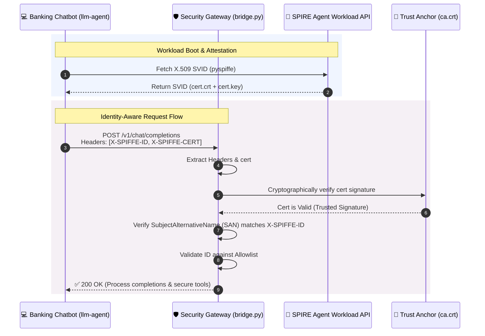

# 🪪 SPIFFE/SPIRE Workload Identity — Teammate Implementation Guide

> [!IMPORTANT]
> This document outlines the design, current implementation status, verification suites, and deployment configuration of **SPIFFE/SPIRE Workload Identity (Layer 2)** in the Secure Runtime Shield. It is designed to get any team member fully up to speed with how Zero-Trust machine-to-machine authentication works in this repository.

---

## 1. Architectural Overview & Context

In a Zero-Trust architecture, we cannot assume that tool execution servers, dashboards, or custom chatbots are trusted simply because they reside on the same network or host. We need **machine-level identities** that are cryptographically verifiable, ephemeral, and automatically rotated.

We use **SPIFFE** (Secure Production Identity Framework for Everyone) and its reference implementation **SPIRE** (SPIFFE Runtime Environment) to solve this:
1. Every component in the system is assigned a unique **SPIFFE ID** structured as a URI: `spiffe://runtime-shield/<workload-name>`.
2. Components retrieve their identities as **X.509 SVIDs** (SVID = SPIFFE Verifiable Identity Document, which is an X.509 certificate) from a local SPIRE agent.
3. The **Security Bridge Gateway (`bridge.py`)** acts as the Policy Enforcement Point (PEP), strictly validating the caller's SVID and SPIFFE ID before processing tool calls or chat completions.



---

## 2. SPIFFE/SPIRE File & Directory Structure

Here is where the SPIFFE/SPIRE implementation resides within the codebase:

```
Runtime-shield-for-agentic-systems/
├── .env                       ← ⚙️ Core configurations (SPIFFE_ENABLED, ALLOWED_SPIFFE_IDS)
├── docker-compose.yml         ← 🐳 Orchestrates SPIRE Server & SPIRE Agent containers
│
├── spire/                     ← 📂 SPIRE Infrastructure Configs
│   ├── server/server.conf     ←    SPIRE Server node/workload database configurations
│   ├── agent/agent.conf       ←    SPIRE Agent attestation & Workload API configurations
│   └── certs/                 ← 🔑 SVID Storage (SVIDs, private keys, and trust bundle)
│       ├── ca.crt / ca.key    ←    Trust Bundle Root CA (Self-signed)
│       ├── bridge.crt/.key    ←    SVID for the Security Bridge Gateway
│       ├── llm-agent.crt/.key ←    SVID for the Streamlit Chatbot
│       ├── agent.crt/.key     ←    Attestation token for SPIRE agent node bootstrap
│       └── dashboard.crt/.key ←    SVID for the live admin dashboard
│
├── generate_certs.py          ← 🛠️ Cert Utility: Cryptographically creates signed SVIDs with URI SANs
├── test_spiffe.py             ← 🧪 SPIFFE Test Suite: Cryptographic validations & integration checks
│
├── bridge.py                  ← 🧠 Main Gateway: Contains strict cryptographic verification logic
│
├── damn-vulnerable-llm-agent/
│   ├── spiffe_integration.py  ← 🔌 Workload-side integration & mTLS connection builder
│   └── main.py                ← 💻 Streamlit UI: Attaches SVID to requests in headers
│
└── src/tools/
    └── spiffeAuth.ts          ← 📦 TypeScript MCP Server Workload Identity verifier
```

---

## 3. Workload-Side Integration (`spiffe_integration.py`)

The file [spiffe_integration.py](file:///c:/Users/Lenovo/Desktop/Runtime-shield-%20login/Runtime-shield-for-agentic-systems/damn-vulnerable-llm-agent/spiffe_integration.py) provides a **three-tier fallback workload identity retriever** (`fetch_svid()`). This ensures the chatbot and tools remain fully functional during development while seamlessly upgrading to military-grade security in staging/production:

| Priority | Tier | Discovery Mechanism | Validation / Security | Use Case |
|---|---|---|---|---|
| **Priority 1** | **SPIRE Workload API** | Connects to SPIRE Workload API via `pyspiffe` client. | **Live Cryptographic Attestation**: SVID is fetched dynamically from the local socket; automatically rotated. | Production / Secure Staging |
| **Priority 2** | **Local Signed SVID** | Reads static `.crt` and `.key` files from `spire/certs/`. | **Offline Cryptographic Validation**: Validates the signature, subject alternative name (SAN), and expiry against `ca.crt`. | Automated integration tests / Local multi-container setups |
| **Priority 3** | **Simulated Identity** | Defaults to `SPIFFE_LLM_ID` environment variable. | **Offline Simulated**: Fallback with mock placeholders (no certs attached). | Local development / Offline coding |

### Cryptographic Attestation Logic inside `fetch_svid`
If a local certificate is loaded, it executes a rigorous cryptographic check using Python's `cryptography` library:
```python
# Extract and verify the certificate's public signature against the CA trust anchor
ca_pubkey = ca.public_key()
ca_pubkey.verify(
    svid.signature,
    svid.tbs_certificate_bytes,
    padding.PKCS1v15(),          # Supports RSA/ECDSA dynamic signature verification
    svid.signature_hash_algorithm
)

# Extract SPIFFE URI from the Subject Alternative Name (SAN) extension
san = svid.extensions.get_extension_for_class(x509.SubjectAlternativeName)
uris = san.value.get_values_for_type(x509.UniformResourceIdentifier)
spiffe_id = [u for u in uris if u.startswith("spiffe://")][0]

# Enforce strict date expiration checks
now = datetime.datetime.utcnow()
if now < svid.not_valid_before or now > svid.not_valid_after:
    raise Exception("SVID has expired or is not yet active")
```

---

## 4. Gateway Verification Engine (`bridge.py`)

The central gateway [bridge.py](file:///c:/Users/Lenovo/Desktop/Runtime-shield-%20login/Runtime-shield-for-agentic-systems/bridge.py) enforces SPIFFE checks globally on the OpenAI-compatible `/v1/chat/completions` completions endpoint and internal stdio bridges.

### 4.1 Activation Check
SPIFFE enforcement is governed by `SPIFFE_ENABLED` in your `.env` file:
```python
spiffe_cfg = {
    "enabled": os.getenv("SPIFFE_ENABLED", "false").lower() == "true",
    "bridge_id": os.getenv("SPIFFE_BRIDGE_ID", "spiffe://runtime-shield/bridge"),
    "server_id": os.getenv("SPIFFE_SERVER_ID", "spiffe://runtime-shield/secure-runtime-shield")
}
```

### 4.2 Verification Pipeline (`verify_svid_cryptographically`)
When an API request hits the gateway, it parses `X-SPIFFE-ID` and `X-SPIFFE-CERT` headers:

1. **Missing ID:** If `X-SPIFFE-ID` is missing, it immediately drops the request with a `403 Forbidden` response.
2. **Signature Verification:** If the `X-SPIFFE-CERT` header is present (containing the PEM certificate chain), it loads it and validates it against `spire/certs/ca.crt`.
3. **Identity Spoofing Protection:** It checks that the `spiffe://` URI parsed directly from the certificate SAN matches the claimed `X-SPIFFE-ID` header. This prevents workload impersonation.
4. **Allowlist Checking:** It verifies the identity belongs to the allowlist configured via `.env`:
   - Exact matching: `spiffe_id in ALLOWED_SPIFFE_IDS`
   - Wildcard matching: Supports dynamic workload IDs using prefix matching (e.g. `spiffe://runtime-shield/spire/agent/x509pop/*` matches wildcard policies).

---

## 5. TypeScript MCP Server Attestation (`src/tools/spiffeAuth.ts`)

The Node.js MCP (Model Context Protocol) Server also asserts its identity on startup inside [spiffeAuth.ts](file:///c:/Users/Lenovo/Desktop/Runtime-shield-%20login/Runtime-shield-for-agentic-systems/src/tools/spiffeAuth.ts):

- **Socket Verification:** Attempts to hook directly into the SPIRE Agent socket (`C:\ProgramData\spire\agent\public\api.sock` on Windows, or `/tmp/spire-agent/public/api.sock` on Linux).
- **CLI Workload API fallback:** If the socket is unreachable, it fires an execution command to fetch the identity from the OS CLI:
  ```typescript
  const output = execSync('spire-agent api fetch x509', { encoding: 'utf8' });
  ```
- **Attestation & Bundle validation:** Checks the extracted SVID certificate matches `process.env.SPIFFE_BUNDLE_PATH` to verify authenticity.

---

## 6. How to Run, Test, and Verify SPIFFE/SPIRE

> [!TIP]
> Use these commands to verify that the SPIFFE setup is healthy and cryptographically secure.

### Step 1: Generate Clean X.509 SVIDs
Generate fresh, non-expired certificates with embedded SPIFFE SANs into your local cert directory:
```powershell
python generate_certs.py
```
This utility automatically populates `spire/certs/` with separate signed keys and certificates for `bridge`, `llm-agent`, `agent`, and `dashboard`.

### Step 2: Run the Crytographic Verification Test Suite
Run the built-in test suite to verify that certificate parsing, signature validations, mTLS context construction, and allowlist lookups pass successfully:
```powershell
python test_spiffe.py
```

Expected output:
```text
======================================================================
RUNTIME SHIELD -- SPIFFE & mTLS VERIFICATION TEST SUITE
======================================================================

=== FEATURE 1: Runtime Cryptographic Attestation ===
  [PASS] bridge: spiffe://runtime-shield/bridge (valid=True)
  [PASS] llm-agent: spiffe://runtime-shield/llm-agent (valid=True)
  [PASS] agent: spiffe://runtime-shield/agent (valid=True)
  [PASS] dashboard: spiffe://runtime-shield/dashboard (valid=True)

=== FEATURE 2: mTLS SSL Context ===
  [PASS] mTLS context built -- verify_mode=CERT_REQUIRED, min_version=TLSv1.2

=== FEATURE 3: Strict SVID Cryptographic Verification ===
  [PASS] Valid llm-agent cert: SVID cryptographically verified: spiffe://runtime-shield/llm-agent
  [PASS] SAN mismatch rejection: SVID SAN 'spiffe://runtime-shield/llm-agent' does not match claimed 'spiffe://evil/hacker'
  [PASS] Allowlist fallback (no cert): Allowlist match (no cert presented)
  [PASS] Allowlist blocks untrusted: SPIFFE ID 'spiffe://untrusted/hacker' not in allowlist and no cert presented

=== Integration check (fetch_svid) ===
  spiffe_id : spiffe://runtime-shield/llm-agent
  attested  : True
  source    : Local SVID (disk) — attestation: passed
  cert_pem  : present
======================================================================
```

### Step 3: Test Gateway Enforcement via Headers
Run the helper script `verify_spiffe_gateway.py` located in the `scratch/` directory. It sends multiple completion requests to the running proxy gateway (port `5001`) with valid, invalid, and missing headers to prove the gateway blocks unauthorized access:
```powershell
python scratch/verify_spiffe_gateway.py
```

- **Missing Header Request:** Returns HTTP `403 Forbidden` with error code `missing_spiffe_identity`.
- **Invalid Header Request (`spiffe://untrusted-workload/hacker`):** Returns HTTP `403 Forbidden` with error code `spiffe_violation` (not in allowlist).
- **Valid Header Request (`spiffe://runtime-shield/llm-agent`):** Returns HTTP `200 OK` and routes correctly.

---

## 7. Configuration Reference (`.env`)

Share these exact configuration values with your teammate to make sure SPIFFE is active:

```bash
# Enable the SPIFFE security gate
SPIFFE_ENABLED=true

# Identify this gateway workload
SPIFFE_BRIDGE_ID=spiffe://runtime-shield/bridge

# Define the expected server identity
SPIFFE_SERVER_ID=spiffe://runtime-shield/secure-runtime-shield

# Allowlist of authorized machine identities
ALLOWED_SPIFFE_IDS=spiffe://runtime-shield/agent,spiffe://runtime-shield/dashboard,spiffe://runtime-shield/bridge,spiffe://runtime-shield/secure-runtime-shield,spiffe://runtime-shield/llm-agent

# SPIRE Agent sockets (Windows / Linux paths)
SPIRE_AGENT_SOCKET=\\.\pipe\spire-agent

# Paths to trust bundles & SVIDs used during static validation
SPIFFE_SVID_PATH=c:\Users\Lenovo\Desktop\Runtime-shield-for-agentic-systems\spire\certs\agent.crt
SPIFFE_BUNDLE_PATH=c:\Users\Lenovo\Desktop\Runtime-shield-for-agentic-systems\spire\certs\ca.crt
```

---

## 8. Current Implementation Status

- **Fully Functional:**
  - **SVID Generation:** Complete. Creates valid x509 SVIDs with SPIFFE URI SANs dynamically (`generate_certs.py`).
  - **Workload Integration:** Complete. Python `fetch_svid()` implements multi-tier fallback with static cryptographic attestation (`spiffe_integration.py`).
  - **Gateway Enforcement:** Complete. `bridge.py` interceptor strictly blocks completions endpoint on header failures, including cryptographic SAN checks.
  - **UI Visualization:** Complete. Streamlit app sidebar displays full cryptographic details of the active workload.
- **In-Progress / Production Enhancements:**
  - **Live SPIRE Attestations:** For full dynamic attestation (Priority 1), the local machine must have the SPIRE server and agent daemons started (`docker-compose up -d` handles container-bound processes, but Windows-local hosts need standard Named Pipe socket exposure or a mounting path to the container socket).
  - **mTLS Network Transport**: `build_mtls_client_session()` builds an `httpx` client configured for TLS with certificates, but calls to `localhost:5001` currently run over plain HTTP with headers. For production, secure the transport with an HTTPS listener using the gateway's own SVID.
