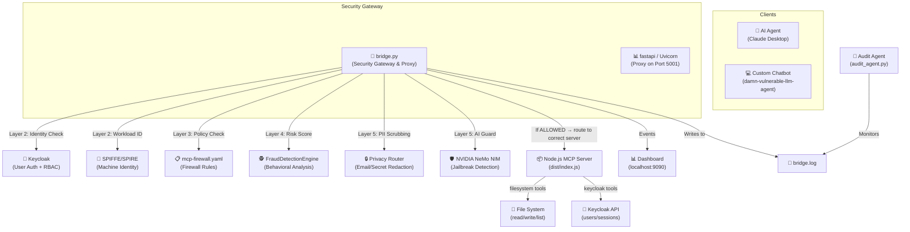
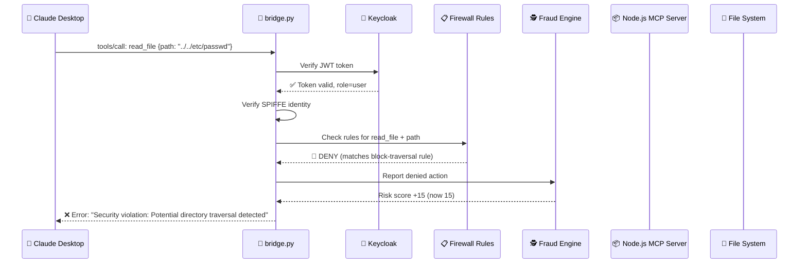
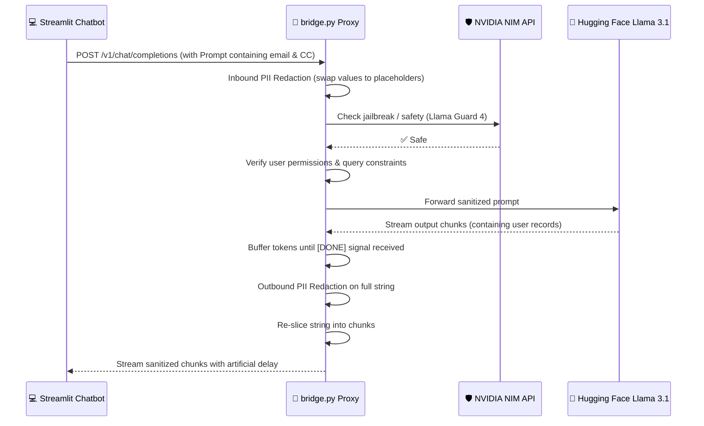

# 🛡️ Runtime Shield for Agentic Systems — Complete Project Walkthrough

> [!NOTE]
> This document explains **every single file**, how they connect, and how the entire system works — written for someone who is brand new to the project. It provides absolute links to the files and main code symbols to let you navigate the codebase instantly.

---

## 1. What Is This Project? (The Big Picture)

Imagine you have an **AI assistant** (like Claude Desktop) that can use "tools" — it can read files, list users, write files, etc. But what if the AI gets **tricked by a malicious prompt (prompt injection)** into reading your passwords, accessing admin-only data, or leaking sensitive customer information?

**This project is a Security Shield** that sits **between** the AI agent and the tools it uses. It inspects every single tool call the AI makes and decides:
- ✅ **Allow** — safe, go ahead
- 🚫 **Block** — nope, that's dangerous
- ✂️ **Redact** — allow it but scrub out sensitive info (like emails, SSNs, credit cards) from the response

### Real-World Analogy
Think of it like an **airport security checkpoint**:
- The AI agent is a passenger trying to board a plane (use a tool)
- The Shield checks their ID (identity verification via Keycloak / JWT)
- Checks if they're on the no-fly list (firewall policies)
- Scans their luggage for weapons (fraud detection & jailbreak analysis)
- Removes any prohibited items (PII / email redaction)

---

## 2. Architecture Overview

The system operates in two core modes:
1. **Stdio Interception Mode:** For local desktop agents like Claude Desktop. The gateway intercepts stdin/stdout streams.
2. **HTTP Proxy Mode:** For custom web-based agents (like the Streamlit app). The gateway exposes an OpenAI-compatible endpoint on port `5001`.



---

## 3. The 5-Layer Defense Framework

Every tool call goes through **5 security layers** before it is allowed to execute:

| Layer | Name | What It Does | Where in Code |
|-------|------|-------------|---------------|
| **Layer 1** | Infrastructure Isolation | Runs tool servers in sandboxed/jailed processes | [BaseJailer](file:///Users/jashan/Documents/Runtime-shield-%20login/Runtime-shield-for-agentic-systems/bridge.py#L302) in [bridge.py](file:///Users/jashan/Documents/Runtime-shield-%20login/Runtime-shield-for-agentic-systems/bridge.py) |
| **Layer 2** | Identity & Auth | Verifies WHO is calling the tool (Keycloak JWT signature + SPIFFE workload ID) | [JWTVerifier](file:///Users/jashan/Documents/Runtime-shield-%20login/Runtime-shield-for-agentic-systems/bridge.py#L597), [spiffe_allowed](file:///Users/jashan/Documents/Runtime-shield-%20login/Runtime-shield-for-agentic-systems/bridge.py#L573) in [bridge.py](file:///Users/jashan/Documents/Runtime-shield-%20login/Runtime-shield-for-agentic-systems/bridge.py) |
| **Layer 3** | Policy Firewall | Checks tool arguments/response against firewall rules | [Gateway.check](file:///Users/jashan/Documents/Runtime-shield-%20login/Runtime-shield-for-agentic-systems/mcp_firewall/sdk.py) and [mcp-firewall.yaml](file:///Users/jashan/Documents/Runtime-shield-%20login/Runtime-shield-for-agentic-systems/mcp-firewall.yaml) |
| **Layer 4** | Fraud Engine | Tracks risk scores per user/agent. Quarantines suspect sessions | [FraudDetectionEngine](file:///Users/jashan/Documents/Runtime-shield-%20login/Runtime-shield-for-agentic-systems/bridge.py#L63) in [bridge.py](file:///Users/jashan/Documents/Runtime-shield-%20login/Runtime-shield-for-agentic-systems/bridge.py) |
| **Layer 5** | Privacy & AI Guard | Redacts PII and detects jailbreaks via LLM guardrails (NVIDIA NIM) | [NIMCloudGuard](file:///Users/jashan/Documents/Runtime-shield-%20login/Runtime-shield-for-agentic-systems/bridge.py#L190) in [bridge.py](file:///Users/jashan/Documents/Runtime-shield-%20login/Runtime-shield-for-agentic-systems/bridge.py) |

---

## 4. File-by-File Breakdown

### 📁 Project Structure

```
Runtime-shield-for-agentic-systems/
├── bridge.py                 ← 🧠 THE BRAIN — main security gateway (Python)
├── mcp-firewall.yaml         ← 📋 Firewall rules and provider configs
├── .env / .env.example       ← 🔐 Environment variables and API keys
├── docker-compose.yml        ← 🐳 Keycloak + SPIFFE/SPIRE infrastructure
├── package.json              ← 📦 Node.js dependencies
├── tsconfig.json             ← ⚙️ TypeScript configuration
├── requirements.txt          ← 🐍 Python dependencies
├── generate_certs.py         ← 🪪 SPIRE certificate generation tool
├── search_events.py          ← 🔍 Keycloak event search script
├── run_shield_demo.sh        ← 🚀 Integrated shell launcher script
├── telemetry.py              ← 📊 Asynchronous database telemetry writer
├── telemetry.db / .log       ← 💾 Persistent governance database & logs
├── bridge.log / _demo.log    ← 📄 Runtime gateway output logs
├── audit_agent.py            ← 🕵️ Standalone/embedded LLM log auditor
├── shield_sdk.py             ← 🔌 Customer-facing Chatbot SDK
├── dashboard_client.py       ← 📊 Negotiator for SaaS policies & vault secrets
├── claude_config.txt         ← 📝 Claude Desktop integration configuration
│
├── src/                      ← 📂 TypeScript Source (MCP Server)
│   ├── index.ts              ←    MCP Server setup and stdio bridge
│   ├── tools/
│   │   ├── tools.ts          ←    FS & Keycloak tool definitions
│   │   ├── rbac.ts           ←    RBAC role validation logic
│   │   └── spiffeAuth.ts     ←    SPIFFE validation for tools
│   └── utils/
│       └── keycloak.ts       ←    Keycloak Admin client
│
├── dist/                     ← 📂 Compiled JavaScript (Target Executable)
│   └── index.js              ←    Node executable spawned by Bridge
│
├── mcp_firewall/             ← 📂 Python mcp-firewall SDK Package
│   ├── sdk.py                ←    Gateway entry point
│   ├── models.py             ←    Config database structures
│   ├── dashboard/
│   │   └── app.py            ←    FastAPI Live Dashboard backend
│   └── schema/
│       └── schema_v2.sql     ←    Telemetry SQLite tables definition
│
├── spire/                    ← 🪪 SPIRE Configuration
│   ├── server/server.conf    ←    SPIRE Server config
│   ├── agent/agent.conf      ←    SPIRE Agent config
│   └── certs/                ←    Root CA and signing keys
│
├── secure-experiment-zone/   ← 🧪 Sandboxed filesystem directory
│   ├── claude-desktop/       ←    Allowed agent working directory
│   └── test_sandbox.txt      ←    Test asset
│
├── damn-vulnerable-llm-agent/ ← 🤖 Chatbot Demonstration App
│   ├── main.py               ←    Streamlit UI and secure agent execution loop
│   ├── tools.py              ←    Chatbot local tools (GetCurrentUser)
│   ├── transaction_db.py     ←    SQLite client database driver with seeder
│   └── transactions.db       ←    Local database containing seeded PII/secrets
│
└── demo/                     ← 📂 Testing scripts and legacy tools
    ├── nsjail_deep_dive.md   ←    Linux sandboxing report
    ├── system_health_check.md←    Post-deployment validation checklist
    └── vulnerable_mcp_actions.py ← Intentionally vulnerable MCP server
```

---

## 5. Deep Dive: Each File Explained

### 🧠 [bridge.py](file:///Users/jashan/Documents/Runtime-shield-%20login/Runtime-shield-for-agentic-systems/bridge.py) — The Core Security Gateway (~2200 lines)

This is the primary security gateway. It supports dual-transport modes:
1. **Stdio Interception Mode:** Intercepts JSON-RPC tool requests between local agents (e.g., Claude Desktop) and Node.js tool executors.
2. **HTTP Proxy Mode (FastAPI):** Exposes an OpenAI-compatible `/v1/chat/completions` endpoint at port `5001`. It intercepts prompt/response histories for chatbots like [main.py](file:///Users/jashan/Documents/Runtime-shield-%20login/Runtime-shield-for-agentic-systems/damn-vulnerable-llm-agent/main.py).

#### Ingress Proxy pipeline checks:
- **Inbound PII Redaction:** Extracts and redacts Email, SSN, Credit Cards, and Phone numbers from prompt strings *before* safety checks to avoid false positive guardrail blocks.
- **NVIDIA NIM Llama Guard 4:** Evaluates conversational safety categories (e.g., prompt injections, jailbreaks, data exfiltration) with a local mock fallback.
- **Topical Guardrails:** Blocks unauthorized categories defined in [mcp-firewall.yaml](file:///Users/jashan/Documents/Runtime-shield-%20login/Runtime-shield-for-agentic-systems/mcp-firewall.yaml).
- **Keycloak RBAC Checks:** Verifies user identity and roles. Ensures standard users cannot query or run tools for other user IDs (ID hijacking protection).

#### Egress Proxy pipeline checks:
- **Egress Buffering:** Collects streamed tokens from upstream LLMs (e.g., Hugging Face Llama 3.1) into a single buffer.
- **Outbound Redaction:** Performs full regex scan on the buffered output to strip any leaked secrets before sending to client.
- **Simulated Streaming:** Slowly streams the sanitized response to the client in 5-character chunks with `asyncio.sleep(0.01)` to preserve typing animation.

#### Key Classes inside [bridge.py](file:///Users/jashan/Documents/Runtime-shield-%20login/Runtime-shield-for-agentic-systems/bridge.py):
* [FraudDetectionEngine](file:///Users/jashan/Documents/Runtime-shield-%20login/Runtime-shield-for-agentic-systems/bridge.py#L63): Tracks risk scores per user/agent. Penalizes denied actions (+15) and PII redactions (+10). Features background score decay thread (-10 points per 30s) and quarantines agents at score $\ge 500$ (e.g. Honeypot traps yield instant $+100$ risk penalty).
* [NIMCloudGuard](file:///Users/jashan/Documents/Runtime-shield-%20login/Runtime-shield-for-agentic-systems/bridge.py#L190): Interfaces with NVIDIA NIM to check for jailbreaks (`meta/llama-guard-4-12b`) and redacts PII.
* [JWTVerifier](file:///Users/jashan/Documents/Runtime-shield-%20login/Runtime-shield-for-agentic-systems/bridge.py#L597): Fetches JWKS keys from Keycloak to verify user JWT signatures.
* [JITTokenManager](file:///Users/jashan/Documents/Runtime-shield-%20login/Runtime-shield-for-agentic-systems/bridge.py#L627): Exchanges broad user tokens for short-lived (60s), single-scope JIT tokens (RFC 8693) before forwarding requests to isolated sandboxes.
* [BaseJailer](file:///Users/jashan/Documents/Runtime-shield-%20login/Runtime-shield-for-agentic-systems/bridge.py#L302) / [LandlockJailer](file:///Users/jashan/Documents/Runtime-shield-%20login/Runtime-shield-for-agentic-systems/bridge.py#L321) / [NSJailer](file:///Users/jashan/Documents/Runtime-shield-%20login/Runtime-shield-for-agentic-systems/bridge.py#L341) / [WindowsJailer](file:///Users/jashan/Documents/Runtime-shield-%20login/Runtime-shield-for-agentic-systems/bridge.py#L368): Pluggable sandboxes that restrict filesystem and network capabilities depending on the host OS.
* [JailFactory](file:///Users/jashan/Documents/Runtime-shield-%20login/Runtime-shield-for-agentic-systems/bridge.py#L379): Picks the correct process jailer depending on OS.

---

### 📋 [mcp-firewall.yaml](file:///Users/jashan/Documents/Runtime-shield-%20login/Runtime-shield-for-agentic-systems/mcp-firewall.yaml) — Policy Configuration

This defines the active policy engine parameters, risk zones, blocked topics, rules, and registers the compilation targets.
* **Honeypot Trap rule (`block-honeypots`):** Maps fake tools (`get_system_config`, `fetch_internal_db`). Access attempts trigger instant critical fraud quarantines.
* **General rules:** Standard directory checks (`block-traversal`, `block-admin-access`), sandbox workspace settings (`allow-experiment-zone-access`), and default fallbacks.
* **Server Registry:** Maps `filesystem-provider` and `keycloak-provider` commands, paths, and tool scopes.

---

### 🕵️ [audit_agent.py](file:///Users/jashan/Documents/Runtime-shield-%20login/Runtime-shield-for-agentic-systems/audit_agent.py) — Asynchronous Telemetry Auditor

Evaluates session transcript history using NIM Llama Guard 4.
* **Embedded Mode:** Runs automatically as a background thread inside [bridge.py](file:///Users/jashan/Documents/Runtime-shield-%20login/Runtime-shield-for-agentic-systems/bridge.py) if `NVIDIA_API_KEY` is present. Updates the dashboard and increases agent risk scores dynamically on safety hits.
* **Role-Awareness:** Adjusts category weights depending on active permissions (e.g., downgrading Code Interpreter category `S14` for authenticated administrators).
* **Standalone Mode:** Can run as a separate process by running `python audit_agent.py`.

---

### 📊 [telemetry.py](file:///Users/jashan/Documents/Runtime-shield-%20login/Runtime-shield-for-agentic-systems/telemetry.py) — Telemetry Database Writer

Implements [TelemetryEventBus](file:///Users/jashan/Documents/Runtime-shield-%20login/Runtime-shield-for-agentic-systems/telemetry.py#L28):
* Utilizes a background thread and thread-safe queue (`process_queue`) to write alerts, requests, and metrics to SQLite (`telemetry.db`).
* Prevents file lock conflicts on SQLite when logging events from high-concurrency connections.

---

### 🤖 [damn-vulnerable-llm-agent/](file:///Users/jashan/Documents/Runtime-shield-%20login/Runtime-shield-for-agentic-systems/damn-vulnerable-llm-agent/) — Chatbot Demo Application

An intentionally vulnerable banking chatbot designed to showcase security protections:
* [main.py](file:///Users/jashan/Documents/Runtime-shield-%20login/Runtime-shield-for-agentic-systems/damn-vulnerable-llm-agent/main.py): Sets up the Streamlit interface and integrates Langchain `ChatLiteLLM` with the Shield Proxy (`http://localhost:5001/v1`). It contains custom interceptors to parse API errors into beautiful warning blocks (e.g., **RBAC Violation**, **Jailbreak Detected**).
* [tools.py](file:///Users/jashan/Documents/Runtime-shield-%20login/Runtime-shield-for-agentic-systems/damn-vulnerable-llm-agent/tools.py): Exposes local ReAct tools `GetCurrentUser` and `GetUserTransactions`.
* [transaction_db.py](file:///Users/jashan/Documents/Runtime-shield-%20login/Runtime-shield-for-agentic-systems/damn-vulnerable-llm-agent/transaction_db.py): SQLite helper which seeds sample users (Marty, Doc, Biff) and transactions containing email patterns, flags, and card numbers.

---

### 🚀 [run_shield_demo.sh](file:///Users/jashan/Documents/Runtime-shield-%20login/Runtime-shield-for-agentic-systems/run_shield_demo.sh) — Integrated Demo Launcher

A shell script to start the complete system:
1. Cleans up stale Python/Streamlit processes and deletes old telemetry databases.
2. Activates the Python virtual environment and starts `bridge.py` in the background (logging output to `bridge_demo.log`).
3. Waits for the proxy server to initialize on port `5001`.
4. Starts the Streamlit agent chatbot on port `8501`.
5. Automatically opens browser tabs for the **Shield Live Dashboard (Port 9090)** and the **Banking Chatbot (Port 8501)**.

---

### 📦 [src/index.ts](file:///Users/jashan/Documents/Runtime-shield-%20login/Runtime-shield-for-agentic-systems/src/index.ts) — Node.js MCP Server Entry Point

Creates the tool-execution server using `@modelcontextprotocol/sdk`.
* Imports [tools.ts](file:///Users/jashan/Documents/Runtime-shield-%20login/Runtime-shield-for-agentic-systems/src/tools/tools.ts) to register tool schemas.
* Runs [verifySpiffeIdentity](file:///Users/jashan/Documents/Runtime-shield-%20login/Runtime-shield-for-agentic-systems/src/tools/spiffeAuth.ts) on startup to verify its workload identity.

---

### 📂 [src/tools/tools.ts](file:///Users/jashan/Documents/Runtime-shield-%20login/Runtime-shield-for-agentic-systems/src/tools/tools.ts) — Tool Definitions

Registers 10 tools mapping to Node.js/TypeScript execution:
- **Filesystem Tools:** `read_file`, `list_directory`, `write_file`.
- **Keycloak Admin Tools:** `keycloak_list_users`, `keycloak_list_user_sessions`, `keycloak_revoke_user_sessions` (admin only), `keycloak_get_user_events`, `keycloak_quarantine_user` (admin only).
- **Report & Policy Tools:** `keycloak_security_report` (compiles audit logs), `keycloak_generate_policy` (converts discovery records to firewall YAML format).

---

## 6. How Everything Connects (Data Flows)

### Stdio / Claude Desktop Mode



### HTTP Proxy Mode (Custom Chatbots)



---

## 7. Key Concepts Explained

### MCP (Model Context Protocol)
An open standard that allows AI agents to interact with tools using **JSON-RPC 2.0** messages over stdio.

### JIT Token Exchange (RFC 8693)
To prevent compromised tool servers from gaining full database access, the bridge swaps the user's broad OAuth token for a JIT token scoped *only* to the specific tool being requested. This token expires automatically after 60 seconds.

### Honeypot Traps
Fake tools registered in policy definitions (`get_system_config`, `fetch_internal_db`). AI models or attackers trying to list/invoke these tools trigger immediate quarantines.

### Learning Mode
Can be toggled via CLI (`python bridge.py --learning`) or the `.env` configuration file. Unknown or blocked tools are logged into `discovery.log` for future rule generation instead of being dropped.

---

## 8. Technology Stack

| Tech | Used For |
|------|---------|
| **Python 3.10+** | Security bridge gateway, FastAPI HTTP Proxy, Fraud engine, Telemetry bus |
| **Node.js / TypeScript** | MCP server implementing tool execution logic |
| **Keycloak** | Identity provider, JWKS signing keys, and RBAC authentication |
| **SPIFFE/SPIRE** | Workload identity attestation for tool components |
| **NVIDIA NeMo NIM** | Safety classifier (`llama-guard-4-12b`) for prompt auditing |
| **Docker Compose** | Container orchestrator for Keycloak and SPIRE services |
| **Langchain / LiteLLM** | ReAct agent framework in the demonstration client |
| **Streamlit** | Chatbot UI and live security stats dashboard |

---

## 9. Quick Reference: "What File Do I Edit For X?"

| Action | File |
|---|---|
| Edit or add firewall policies | [mcp-firewall.yaml](file:///Users/jashan/Documents/Runtime-shield-%20login/Runtime-shield-for-agentic-systems/mcp-firewall.yaml) |
| Add new Node.js MCP tools | [src/tools/tools.ts](file:///Users/jashan/Documents/Runtime-shield-%20login/Runtime-shield-for-agentic-systems/src/tools/tools.ts) (rebuild via `npm run build`) |
| Edit the fraud engine threshold/decay | [bridge.py](file:///Users/jashan/Documents/Runtime-shield-%20login/Runtime-shield-for-agentic-systems/bridge.py) (inside `FraudDetectionEngine`) |
| Change API ports or credentials | [.env](file:///Users/jashan/Documents/Runtime-shield-%20login/Runtime-shield-for-agentic-systems/.env) |
| Customize the chatbot UI or agent flow | [damn-vulnerable-llm-agent/main.py](file:///Users/jashan/Documents/Runtime-shield-%20login/Runtime-shield-for-agentic-systems/damn-vulnerable-llm-agent/main.py) |
| Adjust Llama Guard category severity | [audit_agent.py](file:///Users/jashan/Documents/Runtime-shield-%20login/Runtime-shield-for-agentic-systems/audit_agent.py) (inside `_parse_guard_response`) |
| Modify telemetry database columns | [telemetry.py](file:///Users/jashan/Documents/Runtime-shield-%20login/Runtime-shield-for-agentic-systems/telemetry.py) + [schema_v2.sql](file:///Users/jashan/Documents/Runtime-shield-%20login/Runtime-shield-for-agentic-systems/mcp_firewall/schema/schema_v2.sql) |
